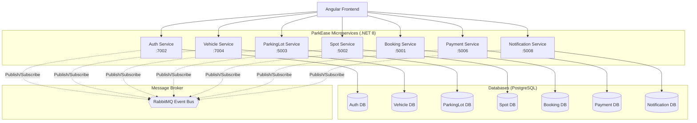
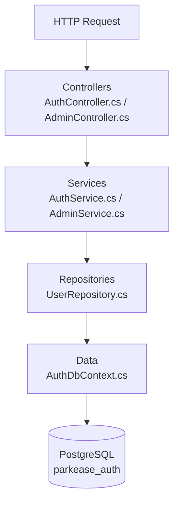
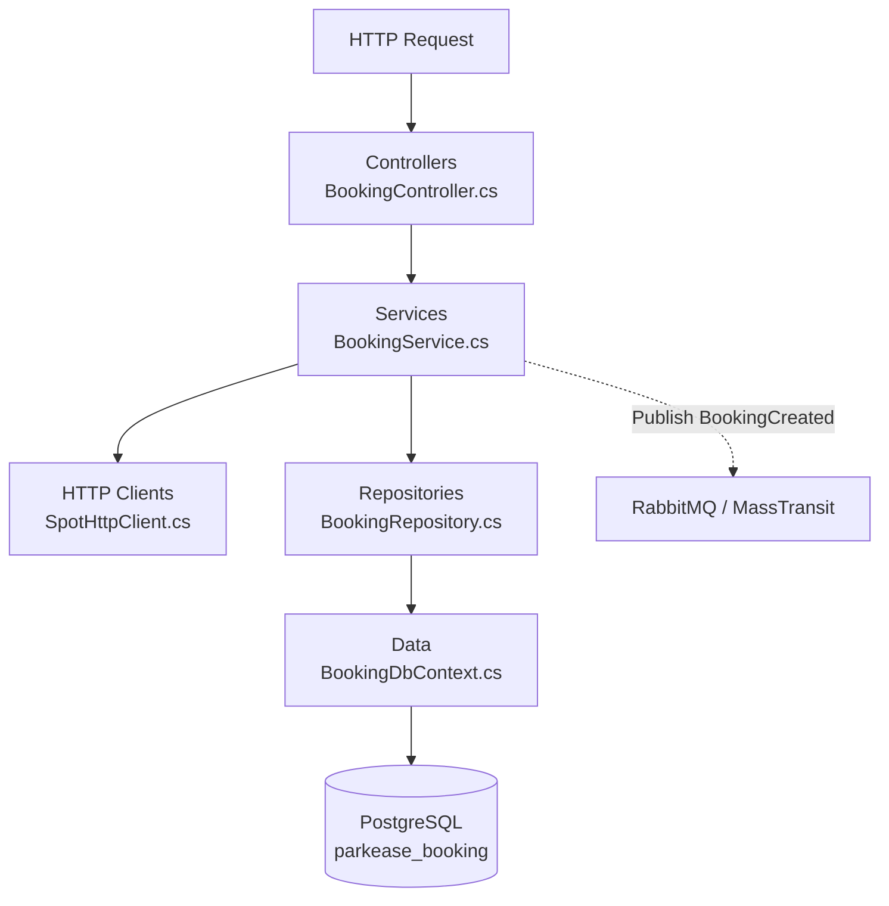
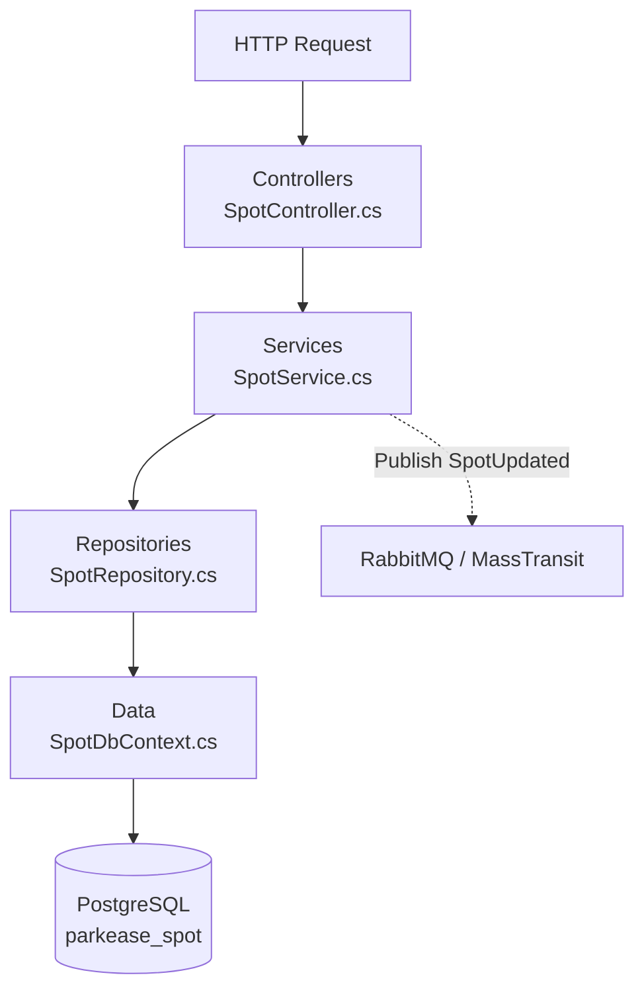
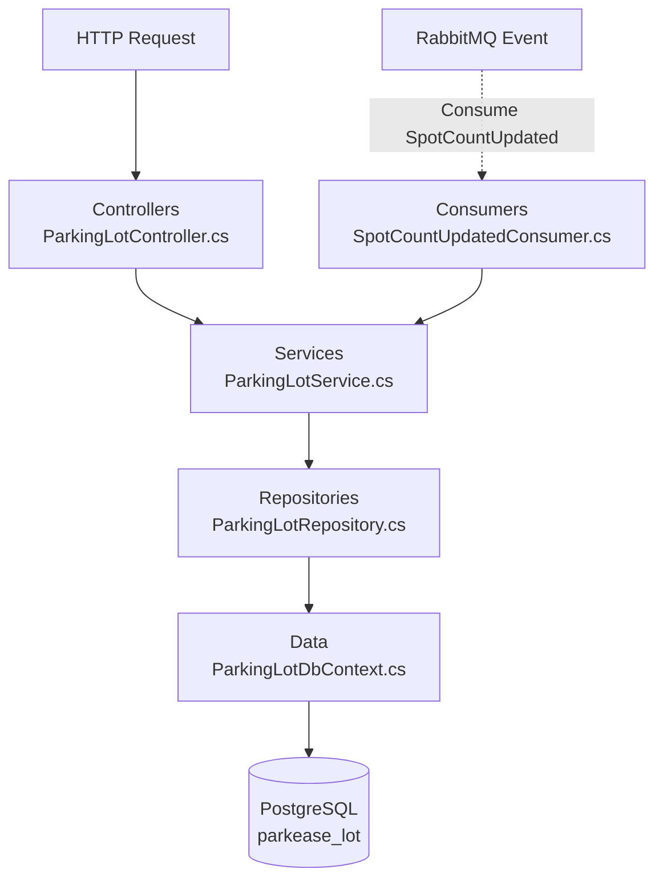
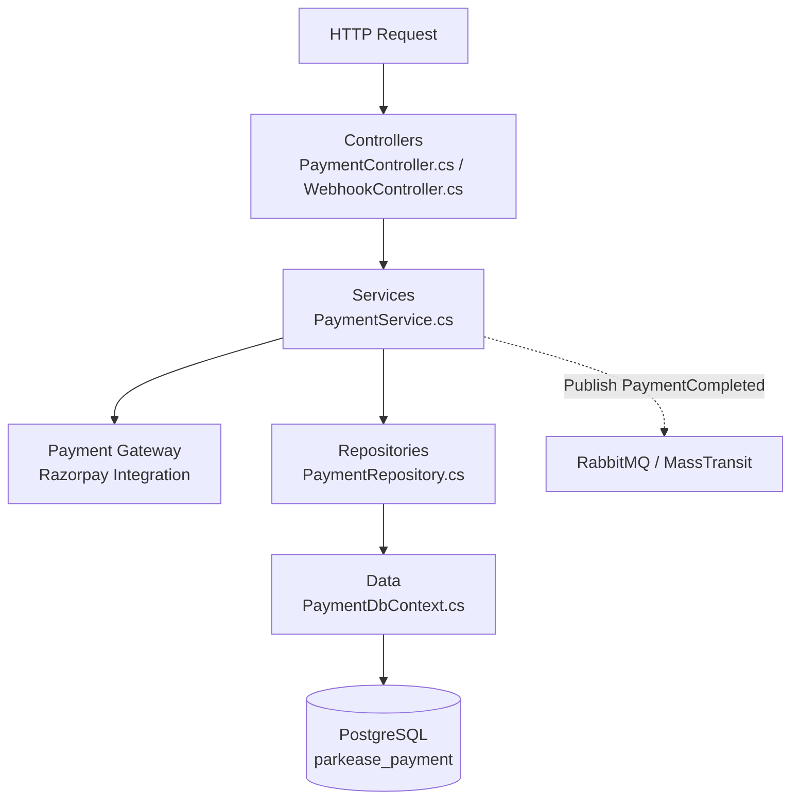
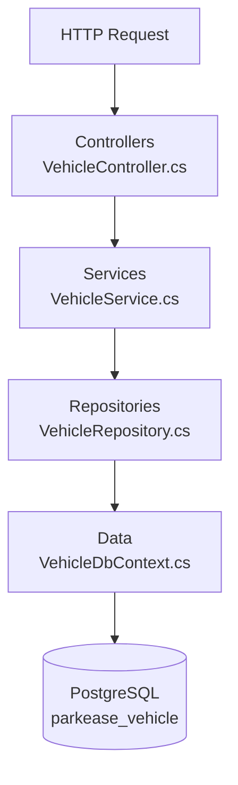
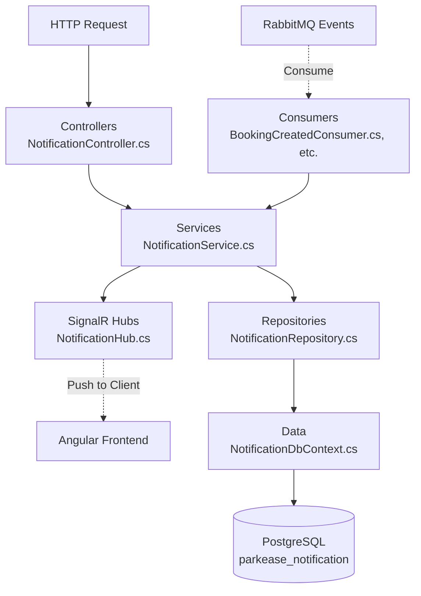
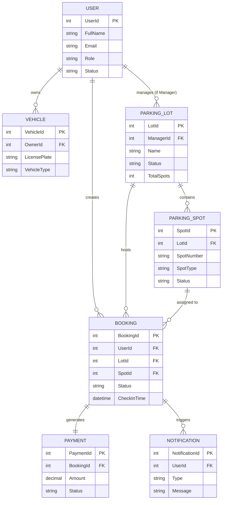

# ParkEase Backend Microservices

This is the backend for the ParkEase application, built using **.NET 8** and a **Microservices Architecture**.

## System Use Case Diagram

The following diagram outlines the overarching use cases across the entire ParkEase platform, mapping all system actors (Guest, Driver, Manager, Admin, System) to their respective capabilities.


## Microservices Architecture & Connectivity




## Running Locally

1. Make sure you have **PostgreSQL** and **RabbitMQ** running.
2. Update the connection strings in the respective `appsettings.json` files if necessary.
3. Run the services from the command line:
   ```bash
   dotnet run --project ParkEase.Auth/ParkEase.Auth.csproj
   # Repeat for other services
   ```
   Or use the provided solution file `ParkEase.sln` to run in Visual Studio or Rider.

## Testing & Quality

- **Unit Tests**: Run tests with `dotnet test ParkEase.Tests/ParkEase.Tests.csproj`
- **SonarQube**: Run the `sonar-scan-backend.ps1` script to analyze the project with SonarQube.

---

## Microservice Internal Workflows (File-to-File Flow)

The following diagrams illustrate the internal execution flow of files within each microservice when an API request is received. The architecture follows a strict Controller -> Service -> Repository -> Database pattern to ensure separation of concerns.

### 1. Auth Service Flow


### 2. Booking Service Flow


### 3. Spot Service Flow


### 4. ParkingLot Service Flow


### 5. Payment Service Flow


### 6. Vehicle Service Flow


### 7. Notification Service Flow

---

## Data Architecture (ER Diagram)

The following diagram illustrates the logical relationships between entities across the different microservice databases.


