# ParkEase Backend Microservices

This is the backend for the ParkEase application, built using **.NET 8** and a **Microservices Architecture**.

## System Use Case Diagram

The following diagram outlines the overarching use cases across the entire ParkEase platform, mapping all system actors (Guest, Driver, Manager, Admin, System) to their respective capabilities.

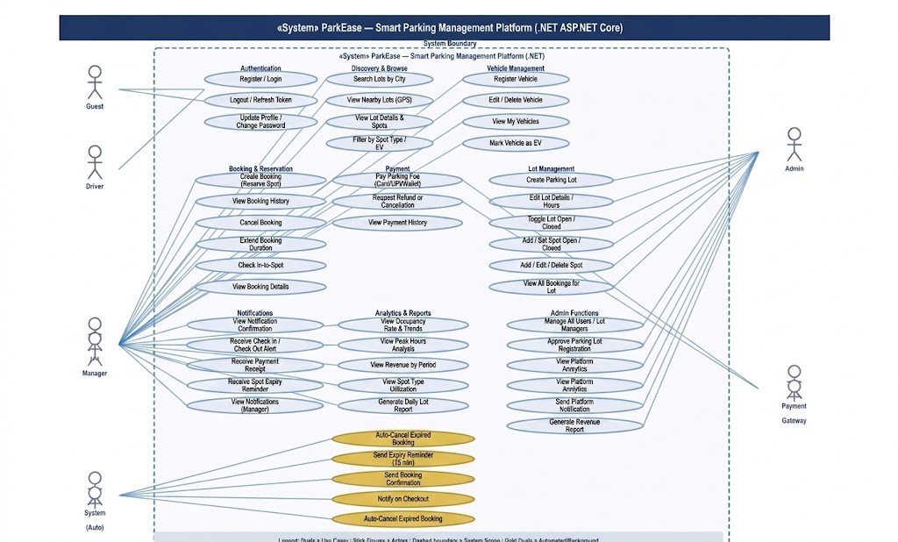

## Microservices Architecture & Connectivity


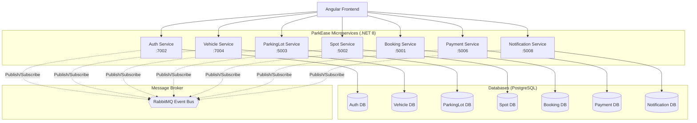

## Running Locally

1. Make sure you have **PostgreSQL** and **RabbitMQ** running.
2. Update the connection strings in the respective `appsettings.json` files if necessary.
3. Run the services from the command line:
   ```bash
   dotnet run --project ParkEase.Auth/ParkEase.Auth.csproj
   # Repeat for other services
   ```
   Or use the provided solution file `ParkEase.sln` to run in Visual Studio or Rider.

## Testing & Quality

- **Unit Tests**: Run tests with `dotnet test ParkEase.Tests/ParkEase.Tests.csproj`
- **SonarQube**: Run the `sonar-scan-backend.ps1` script to analyze the project with SonarQube.

---

## Microservice Internal Workflows (File-to-File Flow)

The following diagrams illustrate the internal execution flow of files within each microservice when an API request is received. The architecture follows a strict Controller -> Service -> Repository -> Database pattern to ensure separation of concerns.

### 1. Auth Service Flow
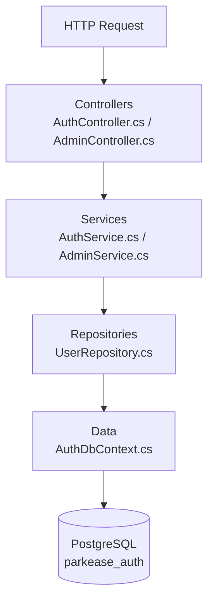

### 2. Booking Service Flow
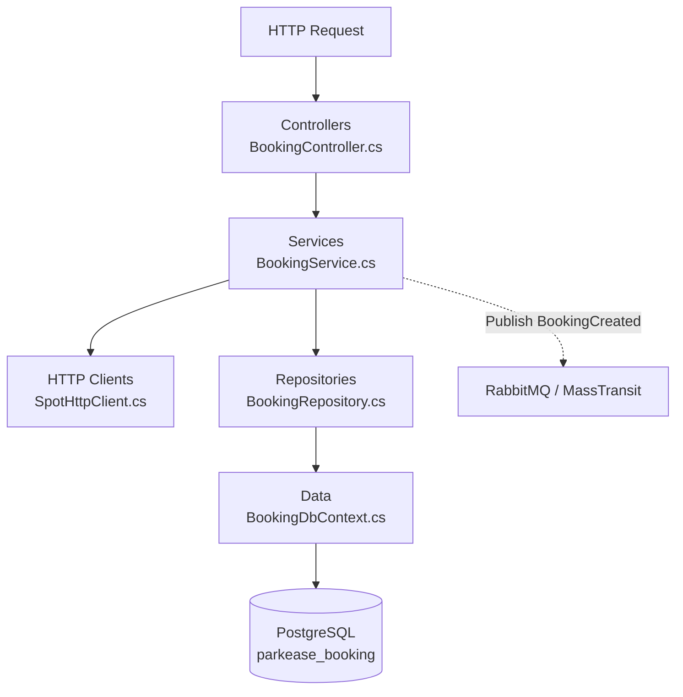

### 3. Spot Service Flow
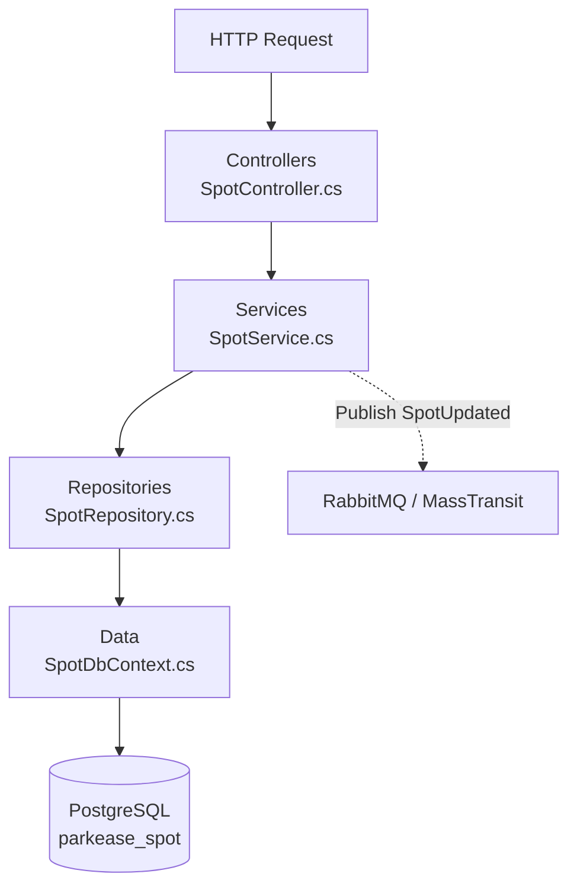

### 4. ParkingLot Service Flow
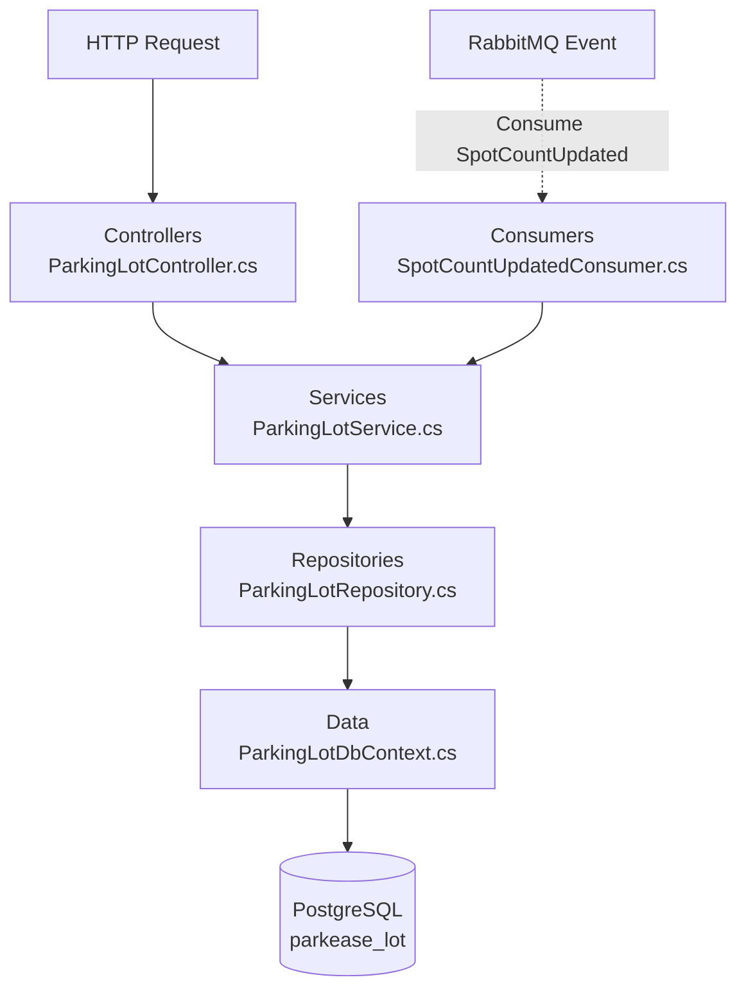

### 5. Payment Service Flow
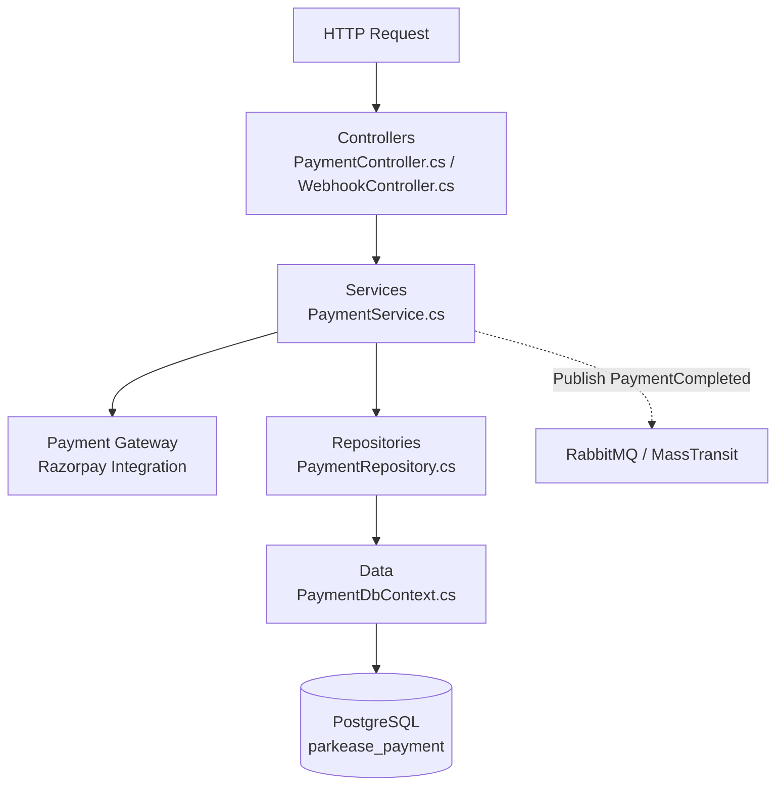

### 6. Vehicle Service Flow
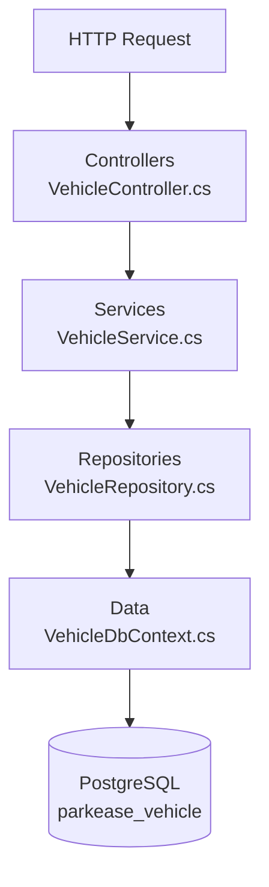

### 7. Notification Service Flow
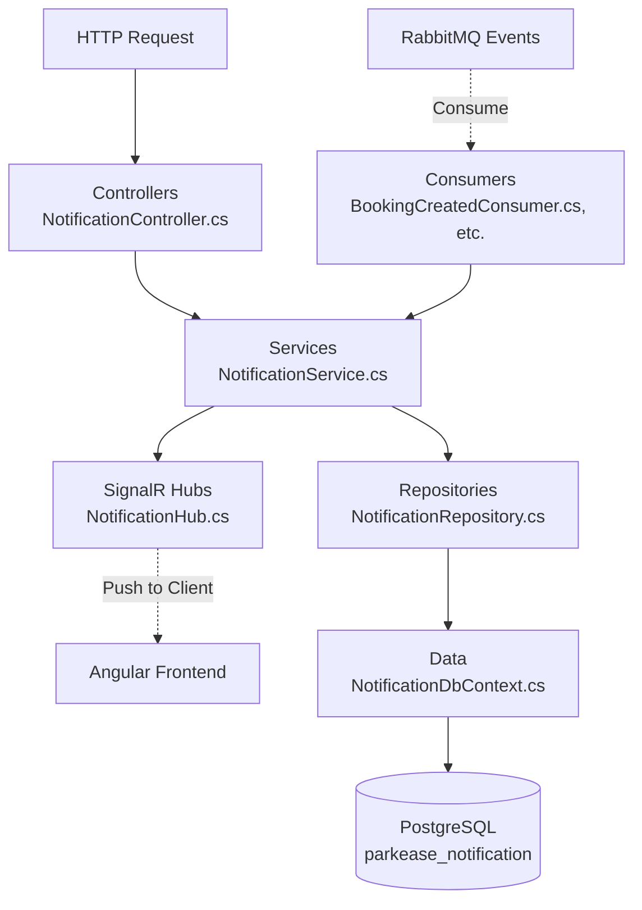
---

## Data Architecture (ER Diagram)

The following diagram illustrates the logical relationships between entities across the different microservice databases.

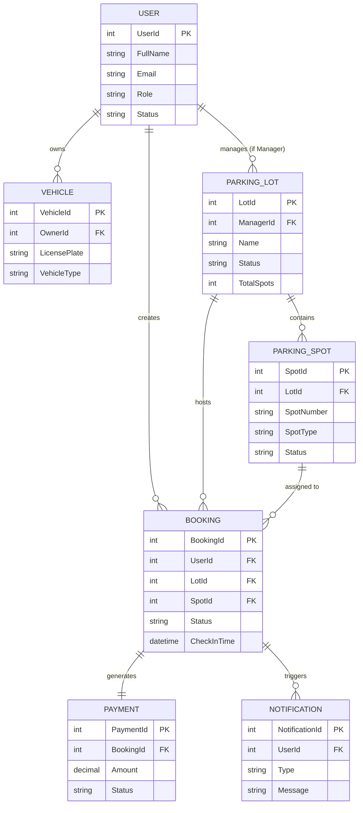

---

## Low-Level Design (LLD) Architectural Diagrams

### 1. Structural Layer-by-Layer Execution Pipeline

All 7 backend microservices follow a clean, decoupled dependency flow designed to ensure strict separation of concerns:

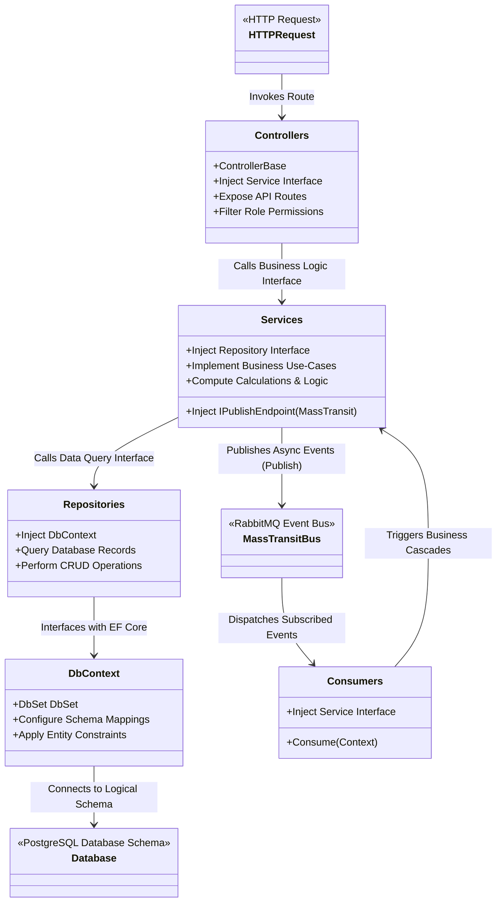

---

### 2. Microservice Dynamic Workflow Sequences

Below are the low-level sequence designs illustrating how the main platform operations run asynchronously across the network.

#### A. Booking Reservation & Spot Allocation Workflow

When a Driver makes a parking reservation on the frontend client, the booking microservice coordinates spot status changes and triggers notification pushes:

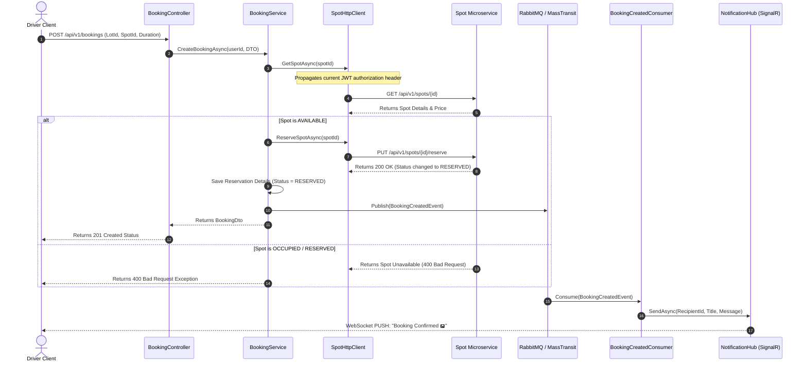

#### B. Check-Out & Payment Verification Flow

Upon vehicle departure, the checkout pipeline calculates the parking duration, initiates a payment gateway handshake, and verifies cryptographic signatures:

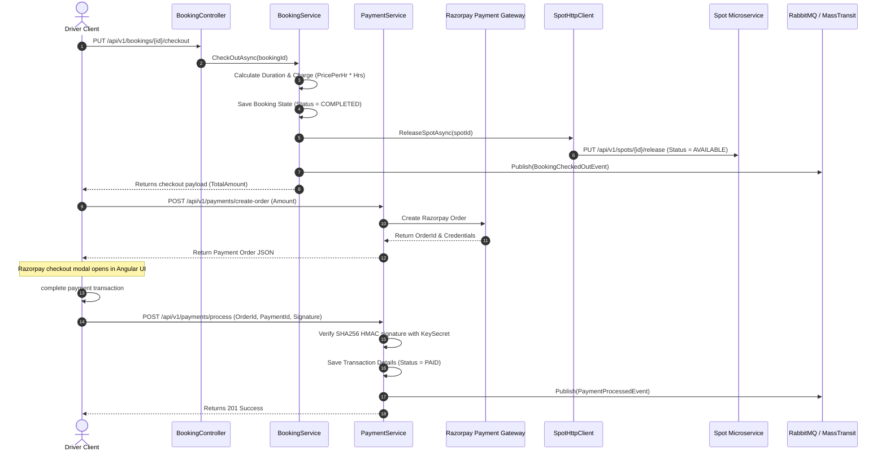

---

### 3. Database Schema Isolation Architecture

All 7 microservices share a single Postgres instance, partitioned logically using dedicated schemas to prevent data collisions and enforce isolated migration boundaries:

| Microservice | Target Postgres Schema | Main Domain Table | Migration Tracking Table |
| :--- | :--- | :--- | :--- |
| **Auth Service** | `auth` | `auth.users` | `auth.__EFMigrationsHistory_Auth` |
| **Vehicle Service** | `vehicle` | `vehicle.vehicles` | `vehicle.__EFMigrationsHistory_Vehicle` |
| **ParkingLot Service** | `parking` | `parking.parking_lots` | `parking.__EFMigrationsHistory_ParkingLot` |
| **Spot Service** | `spot` | `spot.parking_spots` | `spot.__EFMigrationsHistory_Spot` |
| **Booking Service** | `booking` | `booking.bookings` | `booking.__EFMigrationsHistory_Booking` |
| **Payment Service** | `payment` | `payment.payments` | `payment.__EFMigrationsHistory_Payment` |
| **Notification Service**| `notification` | `notification.notifications`| `notification.__EFMigrationsHistory_Notification` |

---
